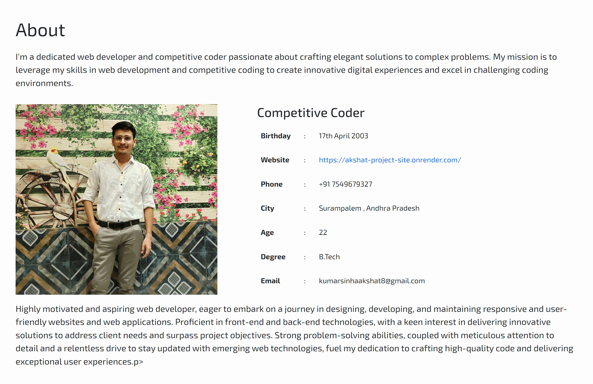
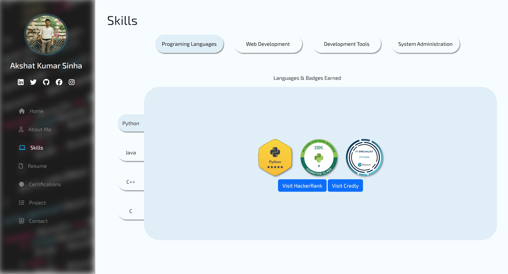
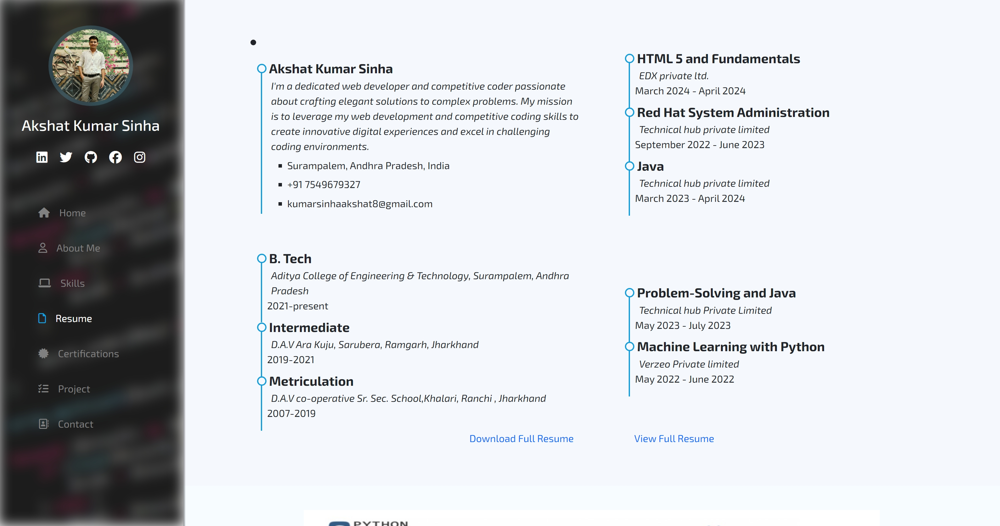
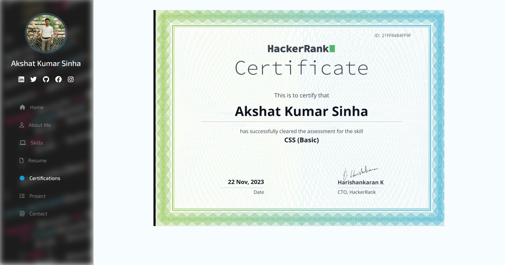
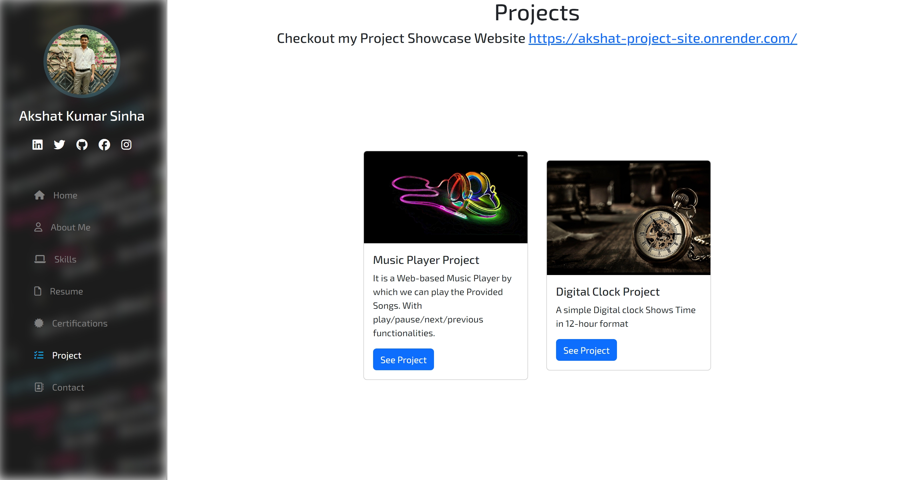
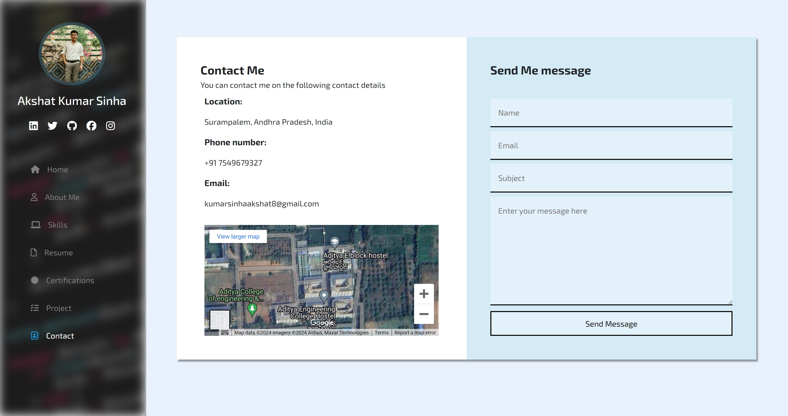
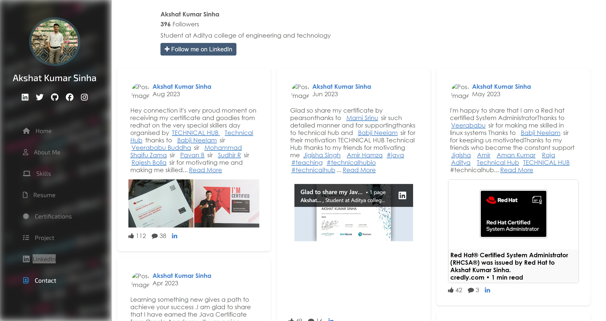

# Aks Portfolio

Welcome to **Aks Portfolio**, a showcase of my skills, projects, and professional journey as a developer. This portfolio was created to provide insight into my work, certifications, and expertise. It also serves as a way for potential collaborators, employers, or fellow developers to get in touch with me.

## Table of Contents

1. [Home](#home)
2. [About](#about)
3. [Skills](#skills)
4. [Resume](#resume)
5. [Certifications](#certifications)
6. [Projects](#projects)
7. [Contact](#contact)
8. [Embedded Social Profiles](#social-profiles)
9. [How to Run the Portfolio](#how-to-run-the-portfolio)
10. [Contributing](#contributing)
11. [License](#license)

---

## Home


The **Home** page is the first interaction point for visitors. It features a sleek and modern design, offering quick navigation options for exploring the different sections of the portfolio. The minimalist design ensures that attention is drawn to the important elements.

---

## About



In the **About** section, you will find a comprehensive overview of my professional background, education, and the technologies that fuel my passion for development. This section explains my journey, values, and what motivates me to keep improving as a developer. 

Some key points covered in this section:
- Personal and professional background
- Brief on my technical journey and education
- A look into my passion for programming and continuous learning

---

## Skills



The **Skills** section is a reflection of my technical expertise, showcasing the tools and technologies I’ve mastered over time. Below is a detailed list of my core competencies:

- **Frontend Development:** HTML, CSS, JavaScript (ES6+), React.js, Redux
- **Backend Development:** Node.js, Express.js
- **Database Management:** MongoDB, MySQL
- **Version Control & Deployment:** Git, GitHub, Vercel
- **Testing Tools:** Jest, Cypress
- **Other Tools:** Webpack, Docker, REST API design, Socket.IO

The section is visually organized for clarity, making it easy to see where my strengths lie.

---

## Resume



This section contains a downloadable version of my **Resume** in PDF format, where you can view my professional experience, educational background, and certifications in more detail.

**Features of the Resume:**
- Detailed overview of my technical and soft skills
- Relevant professional experiences with timelines
- Educational qualifications and achievements
- Certifications in various technologies

---

## Certifications



The **Certifications** section highlights the credentials I've earned throughout my career, validating my knowledge and skills in different areas of development.

Key certifications:
- **Frontend Development:** Advanced JavaScript, React.js
- **Backend Development:** Node.js, Express.js, MongoDB
- **Cloud & DevOps:** AWS, Docker
- **Testing & Automation:** Cypress, Jest

This section ensures that my skills are backed by official recognition, offering a strong testament to my capabilities.

---

## Projects



The **Projects** section showcases the projects I’ve worked on. Each project includes:
- **Project Title**
- **Description:** What the project does, and its relevance.
- **Tech Stack:** The technologies used to build the project.
- **Links:** Access to the live project and its GitHub repository.

### Highlighted Projects:
1. **Color Changer** – A dynamic UI project that changes the page color based on user input. [View Project](#)
2. **Digital Clock** – A real-time digital clock built with vanilla JavaScript. [View Project](#)
3. **Number Guessing Game** – An interactive number guessing game. [View Project](#)

Each project includes screenshots, brief descriptions, and repository links, showcasing my hands-on experience.

---

## Contact



In the **Contact** section, visitors can directly get in touch with me via the integrated contact form. Feel free to reach out for:
- Collaboration opportunities
- Project or freelance inquiries
- General questions or advice

The contact form is designed to ensure a smooth communication process, allowing users to fill out a simple form to send me a message.

---

## Embedded Social Profiles



The **Social Profiles** section dynamically updates based on the user's selection of social platforms. Users can easily connect with me through:
- **LinkedIn**
- **GitHub**
- **Twitter**

The embedded component allows for easy navigation to my social media profiles where users can see more of my work and professional engagements.

---

## How to Run the Portfolio

To view the portfolio locally or modify it, follow these steps:

### Prerequisites:
- You need Node.js installed.
- Git installed on your machine.

### Clone the Repository:

```bash
git clone https://github.com/your-username/aks_portfolio.git
cd aks_portfolio
```
---
### Install Dependencies
If the project requires any additional dependencies, make sure to install them by running:
```bash
npm install
```
---
### Run this project
```bash
npm start
```
This will start a local server where you can view and interact with the portfolio.
---

### Thank You for Visiting 

If you like what you see, don’t hesitate to connect with me on [LinkedIn](https://www.linkedin.com/in/akshatkumarsinha1704/) or follow me on [Github](https://github.com/AKS1719).


